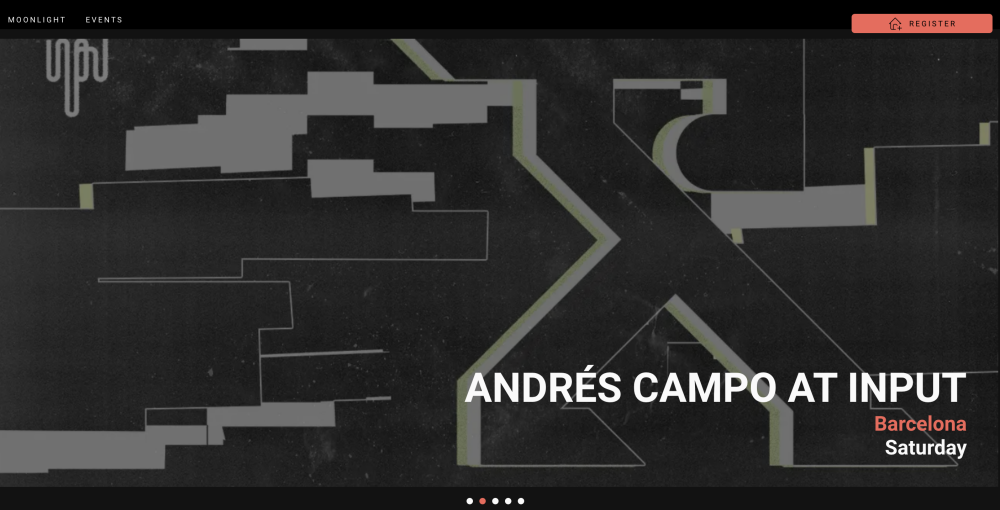
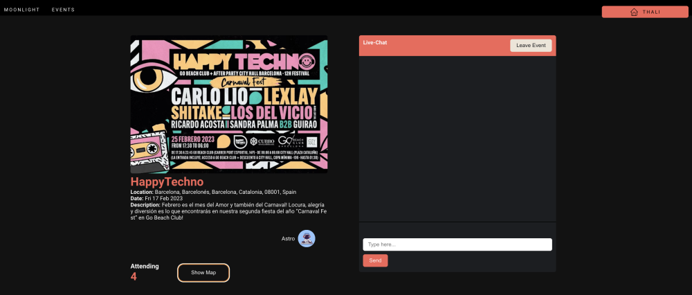
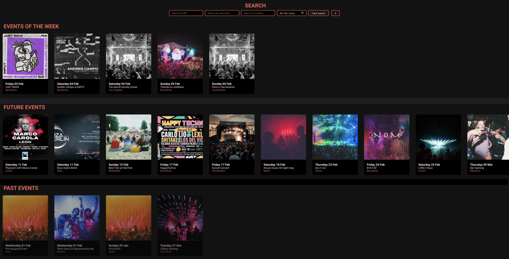
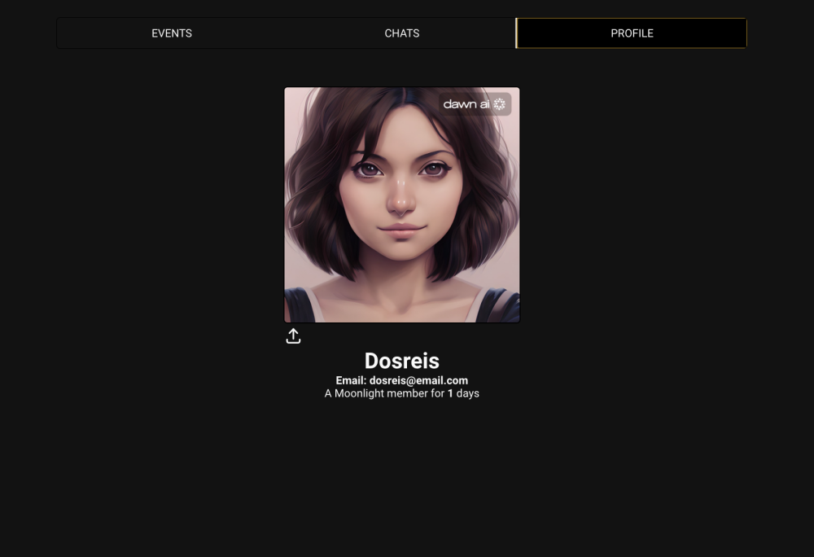

# Moonlight Web Application

## About this project

Moonlight is a MERN web application which allows users to discover, promote, and attend various events such as concerts, festivals, workshops, and more.

Built as the last project of Ironhack's Web Development Bootcamp.

## Build with

* React.js
* Node.js
* MongoDB
* Express.js
* Socket.io

## Features

The website has CRUD functionality, allowing users to create, read, update and delete their own events. As well as join existing events and participate on a live chat of each of this events.

We can search events by user, content, location and date.

Users have a profile page where they can update their avatar, list of the chats they participate on and manage the events they created.

## Demo

Link to [Moonlight](https://moonlight-events.netlify.app/)

## Installation

To install the project, please fork the repository and run `npm install` in the terminal. You will also need to create an account with Cloudinary and set the following environment variables in the .env file.

REACT_APP_API_URL

### `Running the application`
In order to run this application, please use ``npm start`` in the terminal and follow further instructions for the express [API](https://github.com/JoTa-Events/moonlight-server).

## Contributors
[Jonnathan](https://github.com/Jogopin) |
[Thalita](https://github.com/ThalitadosReis)